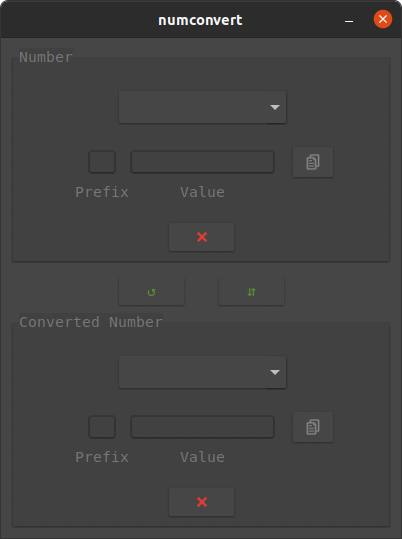
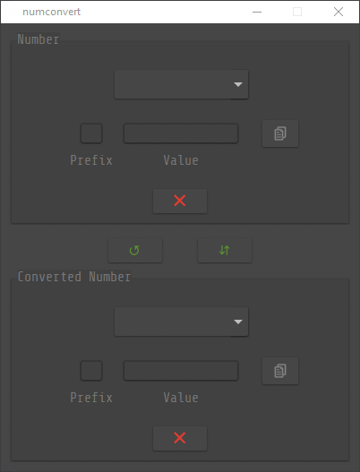

# numconvert
Simple converter for various numeral systems (binary, octal, hexadecimal, ...).

## Content
1. [Overview](#overview)
2. [Compatibility](#compatibility)

## Overview

## Compatibility
### Operating systems
Following operating systems are tested and supported:
- Ubuntu 20.04 LTS
- Windows 10

The binary files of the program were also compiled on these systems.

### Source code

The source code is running on Python version 3.8. 
Following packages, not included in the standard library, are required:
- Pillow
- pyglet
- pyperclip
- ttkthemes

- PyInstaller (used for compiling)
